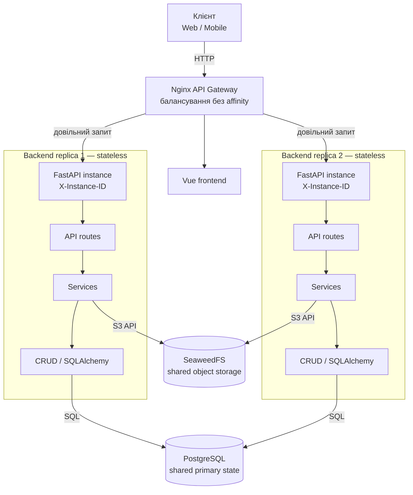

# LogiFlow

Проєкт містить backend на FastAPI, frontend на Vue, PostgreSQL та S3-сумісне
сховище SeaweedFS. Матеріали та результати лабораторної роботи № 2 наведені
нижче; детальний опис request flow і запуску тесту — у `lab_2/README.md`.

## Лабораторна робота № 2: stateless backend

### Аудит стану застосунку

| Категорія | Стан/механізм | Розміщення та висновок |
|---|---|---|
| Ephemeral / Local Safe | Тимчасові змінні запиту, ORM-об'єкти та `AsyncSession` | Створюються на запит; бізнес-дані зберігаються в PostgreSQL |
| Ephemeral / Local Safe | Пул з'єднань SQLAlchemy і S3 SDK session | Локальні технічні ресурси процесу, не є джерелом бізнес-стану |
| Ephemeral / Local Safe | Логи, діагностика, буфер завантажуваного файлу | Не використовуються для відновлення чи передачі бізнес-стану |
| Shared / Externalized | Користувачі, замовлення, маршрути, рахунки та інші записи | PostgreSQL — спільне первинне сховище з Docker volume |
| Shared / Externalized | Фото доставки | SeaweedFS через S3 API |
| Shared / Externalized | Access/refresh контекст | Підписані JWT у клієнтських cookies; секрет та налаштування спільні через env |
| Critical Stateful Dependencies | Глобальні бізнес-колекції, локальний бізнес-кеш, локальні лічильники/блокування, файлові сесії | У `backend/app` не виявлені; сесії авторизації не зберігаються в пам'яті backend |

`order_service`, `user_service` та `s3_client` є модульними об'єктами, але не
зберігають змінний бізнес-стан між запитами: стан замовлень/користувачів
зчитується з PostgreSQL, а об'єкти S3 працюють із зовнішнім сховищем.
Визначення переходів статусу й дозволених типів файлів — незмінна конфігурація,
а не runtime-стан. In-memory буфер під час завантаження фото є тимчасовим
payload запиту, не сесією чи довготривалим сховищем.

### C4-схема: реплікований backend і спільні сховища



Обидві репліки зібрані з одного сервісу Compose. Заголовок `X-Instance-ID`
ідентифікує обробник; він не впливає на вибір репліки. Бізнес-сховище спільне,
тому sticky sessions не потрібні.

### Запуск і перевірка

У PowerShell з кореня репозиторію:

```powershell
docker compose -f .\infrastructure\docker-compose.yml up --build --scale backend=2 -d
docker compose -f .\infrastructure\docker-compose.yml exec backend alembic upgrade head
uv run --project .\backend --group dev python .\lab_2\resilience_test.py --base-url http://localhost
```

Тест створює одноразового користувача та замовлення, потім перевіряє
`POST → GET → PATCH → GET`: create/read і update/read мають бути оброблені
різними instance ID та повертати актуальний стан.

Для перевірки втрати репліки передайте ID або ім'я одного контейнера backend:

```powershell
$instance = docker compose -f .\infrastructure\docker-compose.yml ps -q backend | Select-Object -First 1
uv run --project .\backend --group dev python .\lab_2\resilience_test.py --base-url http://localhost --stop-instance $instance
```

Скрипт зупиняє вказаний контейнер, повторює читання через gateway, перевіряє,
що запит обробила інша репліка та повернула збережену зміну, а потім запускає
зупинений контейнер знову. Для ручних cURL-прикладів див.
[`lab_2/README.md`](lab_2/README.md).

Для локального HTTP встановіть `COOKIE_SECURE=False` у
`infrastructure/.env.backend`; для HTTPS залишайте `True`.
