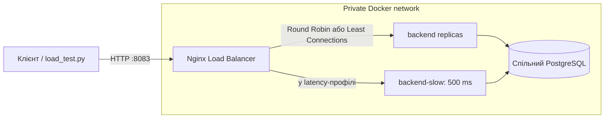

# Лабораторна робота № 3: горизонтальне масштабування та балансування

## Мета та реалізація

У роботі розгорнуто пул backend-екземплярів зі спільними сховищами, налаштовано
Nginx як єдину зовнішню точку входу та перевірено алгоритми балансування й
поведінку системи при відмові вузла. Стенд запускається окремо від лабораторної
№ 2.

## Архітектура



Команди виконуються з кореня репозиторію у PowerShell. Перед запуском мають
бути налаштовані `infrastructure/.env.backend` та `infrastructure/.env.db`:

```powershell
$compose = '.\lab_3\docker-compose.yml'
docker compose -f $compose up --build --scale backend=2 -d
docker compose -f $compose exec -T backend alembic upgrade head
docker compose -f $compose ps
```

## 2.1. Конфігурація пулу backend-сервісів

Compose запускає backend із єдиної збірки; кількість реплік задається через
`--scale backend=N`. Усі репліки підключаються до спільної PostgreSQL. Кожен
екземпляр повертає свій `X-Instance-ID`, щоб можна було спостерігати розподіл
запитів.

## 2.2. Єдина точка входу та інкапсуляція мережі

Зовнішній порт `8083` опублікований лише для Nginx. Backend і PostgreSQL не
публікують портів на хост і доступні лише у приватній Compose-мережі. Клієнти
надсилають запити через `http://localhost:8083`; Nginx маршрутизує їх до
upstream-пулу. Окрема база й Docker volume стенду ізольовані від ЛР № 2.

## 2.3. Дослідження та порівняльний аналіз алгоритмів

### 2.3.1. Round Robin

Round Robin використовується у конфігурації за замовчуванням. Для вимірювання
розподілу 300 запитів між двома екземплярами:

```powershell
uv run --project .\backend --group dev python .\lab_3\load_test.py --base-url http://localhost:8083 --requests 300 --concurrency 30 --label rr-2 --csv .\lab_3\results\rr-2.csv
```

Nginx послідовно розподіляє запити між доступними вузлами; за однакових умов
розподіл має бути приблизно рівномірним. `load_test.py` виводить статуси,
латентність і кількість відповідей за `X-Instance-ID`, а `--csv` зберігає
результати запитів.

### 2.3.2. Альтернативний алгоритм: Least Connections

Той самий пул можна перевірити з Least Connections:

```powershell
$env:LAB3_UPSTREAM_CONFIG = '.\upstream-least-conn.conf'
docker compose -f $compose up -d --no-deps --force-recreate nginx
uv run --project .\backend --group dev python .\lab_3\load_test.py --base-url http://localhost:8083 --requests 300 --concurrency 30 --label least-conn-2 --csv .\lab_3\results\least-conn-2.csv
Remove-Item Env:LAB3_UPSTREAM_CONFIG -ErrorAction SilentlyContinue
```

`least_conn` надсилає запит вузлу з найменшою кількістю активних з'єднань і
може бути корисним для запитів різної тривалості. На коротких однотипних
запитах різниця з Round Robin може бути незначною.

### 2.3.3. Асиметричне навантаження та затриманий вузол

Профіль `latency` додає backend, що затримує обробку кожного запиту на 500 мс.
У пулі один звичайний і один затриманий вузол. Спершу запустіть Round Robin:

```powershell
$env:LAB3_UPSTREAM_CONFIG = '.\upstream-round-robin-latency.conf'
docker compose -f $compose --profile latency up -d --scale backend=1 backend backend-slow nginx
Start-Sleep -Seconds 3
uv run --project .\backend --group dev python .\lab_3\load_test.py --base-url http://localhost:8083 --requests 300 --concurrency 50 --label rr-latency --csv .\lab_3\results\rr-latency.csv
```

Потім повторіть з Least Connections:

```powershell
$env:LAB3_UPSTREAM_CONFIG = '.\upstream-least-conn-latency.conf'
docker compose -f $compose --profile latency up -d --no-deps --force-recreate nginx
uv run --project .\backend --group dev python .\lab_3\load_test.py --base-url http://localhost:8083 --requests 300 --concurrency 50 --label least-conn-latency --csv .\lab_3\results\least-conn-latency.csv
Remove-Item Env:LAB3_UPSTREAM_CONFIG -ErrorAction SilentlyContinue
```

Затримка синтетична й не моделює CPU-навантаження. У збереженому прогоні Round
Robin рівномірно розподілив запити, і половина потрапила на повільний вузол;
Least Connections спрямувала більшість запитів на швидку репліку. Це знизило
p50/p95, але p99 у цьому окремому прогоні виявився вищим за Round Robin.
Одного короткого прогону недостатньо, щоб довести загальну перевагу алгоритму.

Результати, перераховані з `latency_ms` у збережених CSV:

| Алгоритм | Розподіл запитів (швидкий / повільний) | p50 (ms) | p95 (ms) | p99 (ms) | Не-2xx |
|---|---:|---:|---:|---:|---:|
| Round Robin (`rr-latency.csv`) | 150 / 150 | 558.5 | 1515.2 | 1809.9 | 0 |
| Least Connections (`least-conn-latency.csv`) | 288 / 12 | 300.2 | 1196.0 | 2022.7 | 0 |

## 2.4. Health Check та Fault Tolerance

### 2.4.1. Endpoint готовності `/health`

Endpoints `GET /health` і `GET /api/v1/health` перевіряють доступність
PostgreSQL запитом `SELECT 1`. Перевірка має тайм-аут 2 секунди та повертає
`503`, якщо база недоступна. Перевірити endpoint через балансувальник:

```powershell
curl.exe -i http://localhost:8083/health
```

### 2.4.2. Виключення несправних вузлів із upstream

Docker Compose регулярно перевіряє readiness backend-контейнерів. Nginx OSS
використовує пасивну перевірку upstream: помилка з'єднання, тайм-аут або
відповідь `5xx` тимчасово виключає вузол із пулу (`max_fails=1`,
`fail_timeout=5s`); `proxy_next_upstream` повторює запит на іншому вузлі.
Активні upstream health checks доступні в Nginx Plus, не OSS.

### 2.4.3. Зупинка backend-вузла та результати failover

Скрипт зупиняє одну backend-репліку, надсилає через Nginx 100 запитів,
перевіряє їхні статуси та `X-Instance-ID`, а потім відновлює контейнер і чекає
на його стан `healthy`. Перед тестом поверніться до звичайного профілю:

```powershell
Remove-Item Env:LAB3_UPSTREAM_CONFIG -ErrorAction SilentlyContinue
docker compose -f $compose --profile latency down
docker compose -f $compose up -d --scale backend=2 backend nginx
$instance = docker compose -f $compose ps -q backend | Select-Object -First 1
uv run --project .\backend --group dev python .\lab_3\load_test.py --base-url http://localhost:8083 --requests 100 --concurrency 20 --label failover --stop-instance $instance --csv .\lab_3\results\failover.csv
docker compose -f $compose ps backend
```

У збереженому прогоні `failover.csv` усі 100 запитів отримали `200` від
працездатної репліки; p50 — 161.6 ms, p95 — 698.9 ms, p99 — 723.2 ms.
Зупинений контейнер після прогону відновився та перейшов у стан `healthy`.

## 2.5. Scale-out експеримент та системний аналіз

### 2.5.1. Порівняння 1, 2 та 3 backend-реплік

Для кожного прогону використано 300 запитів із паралельністю 30. Nginx і
PostgreSQL спільні; змінюється кількість backend-реплік:

```powershell
docker compose -f $compose up -d --scale backend=1 backend nginx
Start-Sleep -Seconds 3
uv run --project .\backend --group dev python .\lab_3\load_test.py --base-url http://localhost:8083 --requests 300 --concurrency 30 --label rr-1 --csv .\lab_3\results\rr-1.csv

docker compose -f $compose up -d --scale backend=2 backend nginx
Start-Sleep -Seconds 3
uv run --project .\backend --group dev python .\lab_3\load_test.py --base-url http://localhost:8083 --requests 300 --concurrency 30 --label rr-2 --csv .\lab_3\results\rr-2.csv

docker compose -f $compose up -d --scale backend=3 backend nginx
Start-Sleep -Seconds 3
uv run --project .\backend --group dev python .\lab_3\load_test.py --base-url http://localhost:8083 --requests 300 --concurrency 30 --label rr-3 --csv .\lab_3\results\rr-3.csv
```

Перцентилі нижче перераховані з `latency_ms` у CSV. CSV не зберігають повний
wall-clock час прогону, отже throughput (req/s) за цими файлами перевірити
неможливо; для вимірювання пропускної спроможності потрібен повторний прогін із
фіксацією загального часу. Не-2xx — кількість запитів, що не повернули успішний
статус 2xx.

| CSV-прогін | Backend-реплік | Запитів | p50 (ms) | p95 (ms) | p99 (ms) | Не-2xx |
|---|---:|---:|---:|---:|---:|---:|
| `rr-1.csv` | 1 | 300 | 89.1 | 316.7 | 458.1 | 0 |
| `rr-2.csv` | 2 | 300 | 106.9 | 270.2 | 359.0 | 0 |
| `rr-3.csv` | 3 | 300 | 193.7 | 896.9 | 1351.4 | 0 |

Додатковий прогін Least Connections із трьома однаково швидкими репліками
(`least-conn-3.csv`) розподілив запити 102/103/95; p50 — 167.8 ms, p95 —
727.6 ms, p99 — 1081.4 ms. Для двох реплік (`least-conn-2.csv`) розподіл
становив 153/147; p50 — 98.0 ms, p95 — 364.7 ms, p99 — 510.8 ms.

### 2.5.2. Bottleneck-аналіз

У цих коротких вимірюваннях latency не зменшується монотонно зі збільшенням
кількості реплік. Endpoint `/health` звертається до спільної PostgreSQL, отже
база даних і ресурси Docker Desktop є ймовірними спільними обмеженнями.
Кожен backend також має власний SQLAlchemy connection pool, тому scale-out
збільшує сумарну потенційну кількість з'єднань до PostgreSQL. Наявних CSV без
метрики throughput недостатньо, щоб однозначно встановити bottleneck або
стверджувати, що масштабування підвищило пропускну спроможність.

Nginx у цьому стенді сам залишається єдиною точкою відмови. Для підвищення
доступності балансувальника потрібні кілька його екземплярів із
Keepalived/VRRP або зовнішній керований load balancer.

## Зупинка окремого стеку лабораторної № 3

```powershell
docker compose -f .\lab_3\docker-compose.yml down
```

Ця команда не видаляє БД volume. Для чистого повторного старту з видаленням
тільки одноразових даних лабораторної № 3:

```powershell
docker compose -f .\lab_3\docker-compose.yml down -v
```
