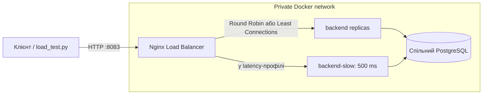

# Лабораторна робота № 3: горизонтальне масштабування та балансування

## Мета та реалізація

У роботі розгорнуто пул із кількох екземплярів backend, налаштовано Nginx як
єдину точку входу та перевірено розподіл запитів і роботу системи при відмові
одного з вузлів. Для порівняння використано алгоритми Round Robin і Least
Connections. Стенд запускається окремо від лабораторної № 2.

## Архітектура



Зовнішній порт `8083` відкритий лише для Nginx. Backend і PostgreSQL не
публікують портів на хост і доступні в приватній Compose-мережі. Для стенду
використовуються окремі база даних і volume `lab_3`.

## Розгортання стенду

Команди виконуються з кореня репозиторію у PowerShell. Для підключення до
сервісів необхідні налаштовані файли `infrastructure/.env.backend` та
`infrastructure/.env.db`.

```powershell
$compose = '.\lab_3\docker-compose.yml'
docker compose -f $compose up --build --scale backend=2 -d
docker compose -f $compose exec -T backend alembic upgrade head
curl.exe -i http://localhost:8083/health
docker compose -f $compose ps
```

Endpoints `GET /health` і `GET /api/v1/health` перевіряють доступність
PostgreSQL запитом `SELECT 1`. Перевірка має тайм-аут 2 секунди та повертає
`503`, якщо база недоступна. Docker Compose регулярно виконує readiness-check
backend-контейнерів. Nginx OSS використовує пасивну перевірку upstream:
помилка з'єднання, тайм-аут або відповідь `5xx` тимчасово виключає вузол із
пулу (`fail_timeout=5s`); `proxy_next_upstream` повторює запит на іншому вузлі.
Активні upstream health checks входять до Nginx Plus, а не OSS.

## Алгоритми балансування

У конфігурації за замовчуванням застосовується Round Robin. Нижче наведено
команду для вимірювання розподілу 300 запитів між двома екземплярами:

```powershell
uv run --project .\backend --group dev python .\lab_3\load_test.py --base-url http://localhost:8083 --requests 300 --concurrency 30 --label rr-2 --csv .\lab_3\results\rr-2.csv
```

Для порівняння той самий пул можна запустити з Least Connections:

```powershell
$env:LAB3_UPSTREAM_CONFIG = '.\upstream-least-conn.conf'
docker compose -f $compose up -d --no-deps --force-recreate nginx
uv run --project .\backend --group dev python .\lab_3\load_test.py --base-url http://localhost:8083 --requests 300 --concurrency 30 --label least-conn-2 --csv .\lab_3\results\least-conn-2.csv
Remove-Item Env:LAB3_UPSTREAM_CONFIG -ErrorAction SilentlyContinue
```

Round Robin послідовно розподіляє запити між доступними вузлами. За однакових
умов розподіл має бути приблизно рівномірним. `least_conn` надсилає запит вузлу
з найменшою кількістю активних з'єднань і може бути ефективнішим для запитів
різної тривалості. На коротких однотипних запитах різниця між алгоритмами може
бути незначною.

## Експеримент із масштабуванням

Для кожного прогону використано 300 запитів із паралельністю 30. Кількість
backend-реплік змінюється, Nginx і PostgreSQL залишаються спільними:

```powershell
docker compose -f $compose up -d --scale backend=1 backend nginx
Start-Sleep -Seconds 3
uv run --project .\backend --group dev python .\lab_3\load_test.py --base-url http://localhost:8083 --requests 300 --concurrency 30 --label rr-1 --csv .\lab_3\results\rr-1.csv

docker compose -f $compose up -d --scale backend=2 backend nginx
Start-Sleep -Seconds 3
uv run --project .\backend --group dev python .\lab_3\load_test.py --base-url http://localhost:8083 --requests 300 --concurrency 30 --label rr-2 --csv .\lab_3\results\rr-2.csv

docker compose -f $compose up -d --scale backend=3 backend nginx
Start-Sleep -Seconds 3
uv run --project .\backend --group dev python .\lab_3\load_test.py --base-url http://localhost:8083 --requests 300 --concurrency 30 --label rr-3 --csv .\lab_3\results\rr-3.csv
```

`load_test.py` виводить пропускну здатність, p50/p95/p99, HTTP-статуси та
розподіл відповідей за `X-Instance-ID`. Параметр `--csv` зберігає результати
окремого прогону у CSV-файл.

## Експеримент із затримкою вузла

Профіль `latency` додає backend, який затримує обробку кожного запиту на
500 мс. У пулі залишається один звичайний і один затриманий вузол. Спершу
виконайте прогін з Round Robin:

```powershell
$env:LAB3_UPSTREAM_CONFIG = '.\upstream-round-robin-latency.conf'
docker compose -f $compose --profile latency up -d --scale backend=1 backend backend-slow nginx
Start-Sleep -Seconds 3
uv run --project .\backend --group dev python .\lab_3\load_test.py --base-url http://localhost:8083 --requests 300 --concurrency 50 --label rr-latency --csv .\lab_3\results\rr-latency.csv
```

Потім повторіть прогін з Least Connections:

```powershell
$env:LAB3_UPSTREAM_CONFIG = '.\upstream-least-conn-latency.conf'
docker compose -f $compose --profile latency up -d --no-deps --force-recreate nginx
uv run --project .\backend --group dev python .\lab_3\load_test.py --base-url http://localhost:8083 --requests 300 --concurrency 50 --label least-conn-latency --csv .\lab_3\results\least-conn-latency.csv
Remove-Item Env:LAB3_UPSTREAM_CONFIG -ErrorAction SilentlyContinue
```

Round Robin не враховує тривалість обробки, тому повільний вузол продовжує
отримувати запити. Least Connections враховує кількість активних з'єднань і
під час прогону спрямовував більшість запитів на швидший вузол. Затримка в
експерименті є синтетичною і не моделює навантаження на CPU.

## Перевірка відмовостійкості

Команда зупиняє одну backend-репліку, надсилає 100 запитів через Nginx і
перевіряє відповіді від репліки, що залишилася. Після прогону скрипт запускає
зупинений контейнер і чекає, поки Docker позначить його як `healthy`. Перед
тестом профілю затримки поверніться до звичайної конфігурації:

```powershell
Remove-Item Env:LAB3_UPSTREAM_CONFIG -ErrorAction SilentlyContinue
docker compose -f $compose --profile latency down
docker compose -f $compose up -d --scale backend=2 backend nginx
$instance = docker compose -f $compose ps -q backend | Select-Object -First 1
uv run --project .\backend --group dev python .\lab_3\load_test.py --base-url http://localhost:8083 --requests 100 --concurrency 20 --label failover --stop-instance $instance --csv .\lab_3\results\failover.csv
docker compose -f $compose ps backend
```

Успішний прогін має завершитися без помилок, повертати `200` і містити
`X-Instance-ID` працездатної репліки.

## Результати

Результати одного прогону на Docker Desktop у Windows: 300 запитів,
паралельність 30, `GET /health`, Round Robin.

| Backend-реплік | Throughput (req/s) | p50 (ms) | p95 (ms) | p99 (ms) | Помилки |
|---:|---:|---:|---:|---:|---:|
| 1 | 151.6 | 131.3 | 571.9 | 811.6 | 0 |
| 2 | 115.5 | 176.5 | 666.7 | 1072.6 | 0 |
| 3 | 70.0 | 237.1 | 1228.9 | 1805.5 | 0 |

Порівняння алгоритмів за затримки одного вузла на 500 мс: два backend-вузли,
300 запитів, паралельність 50.

| Навантаження | Алгоритм | Throughput (req/s) | p50 (ms) | p95 (ms) | p99 (ms) | Помилки |
|---|---|---:|---:|---:|---:|---:|
| Затримка 500 ms на одному вузлі | Round Robin | 70.7 | 467.2 | 1856.8 | 2111.3 | 0 |
| Затримка 500 ms на одному вузлі | Least Connections | 121.4 | 233.1 | 938.0 | 1339.2 | 0 |

У додатковому прогоні трьох однаково швидких реплік Least Connections показав
113.3 запиту/с і p99 1081.4 мс.

У цих вимірюваннях додавання backend-реплік не збільшило пропускну здатність.
Endpoint `/health` звертається до спільної бази PostgreSQL, тому база та
ресурси локального Docker Desktop можуть обмежувати результат. Кожен backend
також має власний SQLAlchemy connection pool; зі збільшенням кількості реплік
зростає загальна кількість можливих з'єднань до PostgreSQL. Результати одного
короткого прогону не є універсальним показником продуктивності: для точнішого
порівняння необхідно повторити вимірювання на тому самому хості.

Під час failover-тесту всі 100 запитів отримали `200` від працездатної
репліки. Зупинений контейнер після тесту відновився та перейшов у стан
`healthy`.

У цій конфігурації Nginx залишається єдиною точкою відмови. Для підвищення
доступності самого балансувальника можна використати кілька його екземплярів
із Keepalived/VRRP або зовнішній керований балансувальник.

## Зупинка окремого стеку лабораторної № 3

```powershell
docker compose -f .\lab_3\docker-compose.yml down
```

Ця команда не видаляє БД volume; для чистого повторного старту з видаленням
тільки одноразових даних лабораторної № 3:

```powershell
docker compose -f .\lab_3\docker-compose.yml down -v
```
