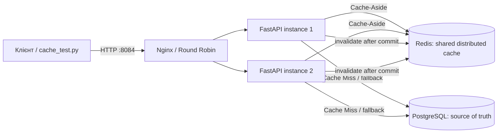

# Лабораторна робота № 4: розподілене кешування

## 2.1. Аналіз та вибір об'єкта кешування

Кешується `GET /api/v1/orders/{order_id}`. Замовлення повторно читаються
клієнтами й менеджерами протягом життєвого циклу доставки, тоді як зміни
відбуваються рідше. Читання за primary key — не складний агрегат, але кожен
повторний запит інакше робить окремий SELECT до PostgreSQL. Cache Hit прибирає
повторне читання замовлення з БД; автентифікація користувача як і раніше
звертається до PostgreSQL.

Допустиме застарівання для змін поза цим API обмежено TTL у 60 секунд. Зміни
замовлення через API інвалідують запис після успішного commit. Кешується лише
DTO замовлення (`OrderOut`), не ORM-сесія чи токени користувачів.
Авторизація клієнта перевіряється і при Cache Hit за `owner_id` із DTO; кеш
не замінює перевірку прав.

## 2.2. Інтеграція розподіленого Cache Storage

Окремий стенд запускає Redis та дві backend-репліки зі спільним доступом до
Redis і PostgreSQL. Redis не публікує порт на хості. Nginx — єдина зовнішня
точка входу на порті `8084`.

Архітектура:



Запуск із кореня репозиторію у PowerShell. Потрібні Docker Compose, `uv` та
налаштовані `infrastructure/.env.backend` і `infrastructure/.env.db`. Для
локального HTTP у `infrastructure/.env.backend` встановіть `COOKIE_SECURE=False`.

```powershell
$compose = '.\lab_4\docker-compose.yml'
docker compose -f $compose up --build --scale backend=2 -d
docker compose -f $compose exec -T backend alembic upgrade head
docker compose -f $compose ps
```

PostgreSQL залишається source of truth. Redis має ліміт 128 MB і політику
витіснення `allkeys-lru`.

## 2.3. Реалізація паттерну Cache-Aside

Для читання замовлення реалізовано такий потік:

1. Backend шукає об'єкт у Redis.
2. **Cache Hit:** десеріалізує `OrderOut`, перевіряє права клієнта й повертає
   відповідь без SELECT замовлення в PostgreSQL.
3. **Cache Miss:** читає замовлення з PostgreSQL, серіалізує DTO, записує його
   у Redis та повертає відповідь.
4. Якщо Redis недоступний або вимкнений, backend читає напряму з PostgreSQL і
   позначає відповідь `X-Cache: BYPASS`.

Інвалідація виконується сервісом після успішних записів у БД. Це Cache-Aside:
застосунок явно читає й наповнює кеш, а база лишається джерелом істини.

## 2.4. Схема ключів та політика TTL

Ключ детального endpoint:

```text
logiflow:order:v1:{order_id}
```

`logiflow` — namespace застосунку, `order` — тип сутності, `v1` — версія DTO
у кеші, `order_id` — ідентифікатор сутності. Endpoint не має параметрів
фільтрації; payload однаковий для користувачів, а доступ клієнта окремо
перевіряється за `owner_id`. При несумісній зміні формату DTO слід збільшити
версію ключа.

| Налаштування | Значення | Призначення |
|---|---|---|
| `ORDER_CACHE_ENABLED` | `true` у ЛР № 4 Compose | Вмикає кеш лише в цьому стенді; типове значення — вимкнено |
| `REDIS_URL` | `redis://redis:6379/0` | Спільне сховище для всіх реплік |
| `ORDER_CACHE_TTL_SECONDS` | `60` | Максимальний вік запису без інвалідації |
| Redis eviction | `allkeys-lru`, 128 MB | Витіснення найменш використовуваних ключів за браку пам'яті |

TTL обмежує застарівання при expiry та змінах поза цим API. Інвалідація після
API commit забезпечує актуальність наступного послідовного читання, якщо Redis
доступний. Це не транзакція між PostgreSQL і Redis: при помилці інвалідації
помилка журналюється, операція БД не відкочується, а запис може лишатися до
TTL. Прямі записи в БД також відображаються в кеші після завершення TTL.

## 2.5. Механізми інвалідації кешу

Після успішного commit ключ замовлення видаляється при:

- `PATCH` і `DELETE` замовлення;
- підтвердженні отримання/доставки;
- переході статусу замовлення, викликаному оновленням статусу маршруту.

Наступний detail GET повертає `MISS`, перечитує свіжий стан із PostgreSQL та
наповнює Redis. Подальший GET повертає `HIT`. Інвалідація фіксується в логах
повідомленням `Order cache invalidated`.

## 2.6. Метрики продуктивності та Fallback

### Метрики Cache Hit / Miss і cold vs hot

Запустіть автоматичний тест:

```powershell
uv run --project .\backend --group dev python .\lab_4\cache_test.py
```

Скрипт створює тестового користувача й замовлення, перевіряє `MISS → HIT`,
порівнює payload та `X-Instance-ID` для доказу спільного Redis між репліками,
виконує PATCH і перевіряє `MISS` із новими даними після інвалідації. У виводі
є заголовок `X-Cache` (`HIT`, `MISS` або `BYPASS`), instance ID та виміряна
латентність кожного запиту.

Два smoke-test прогони на локальному Docker Desktop:

| Прогін | Cold GET (`MISS`, ms) | Hot GET (`HIT`, ms) | Instance |
|---|---:|---:|---|
| 1 | 14.5 | 11.7 | Різні для MISS та HIT |
| 2 | 10.8 | 6.8 | Різні для MISS та HIT |

Це короткі вимірювання, не статистично значущий benchmark; латентність
залежить від хоста й навантаження. В обох прогонах PATCH змінив title,
наступний GET повернув `MISS` з новими даними, а подальший GET — `HIT`.

### Fallback при відмові Redis

Передайте скрипту ID Redis-контейнера:

```powershell
$redis = docker compose -f $compose ps -q redis
uv run --project .\backend --group dev python .\lab_4\cache_test.py --stop-redis $redis
```

Скрипт прогріває кеш, зупиняє Redis і перевіряє, що GET повертає
`X-Cache: BYPASS` з актуальними даними з PostgreSQL. Після тесту Redis
автоматично запускається знову; скрипт чекає на `healthy`.

Помилки Redis читаються/журналюються, операція читання продовжується через БД.
Timeout підключення й операцій Redis — 250 ms. При недоступному Redis помилка
інвалідації не впливає на відповідь запису; якщо запис залишився в кеші,
після відновлення він може бути застарілим до TTL. Cache stampede можливий,
коли багато запитів одночасно бачать Miss; для більшого навантаження можна
додати single-flight/lock або jitter TTL. Cache avalanche зменшують jitter-ом
TTL та поступовим прогрівом. Expiration видаляє ключ автоматично з часом,
invalidation — примусово після бізнес-зміни.

## Зупинка окремого стеку лабораторної № 4

```powershell
docker compose -f .\lab_4\docker-compose.yml down
```

Щоб видалити також тестову PostgreSQL volume лише цього стенду:

```powershell
docker compose -f .\lab_4\docker-compose.yml down -v
```
